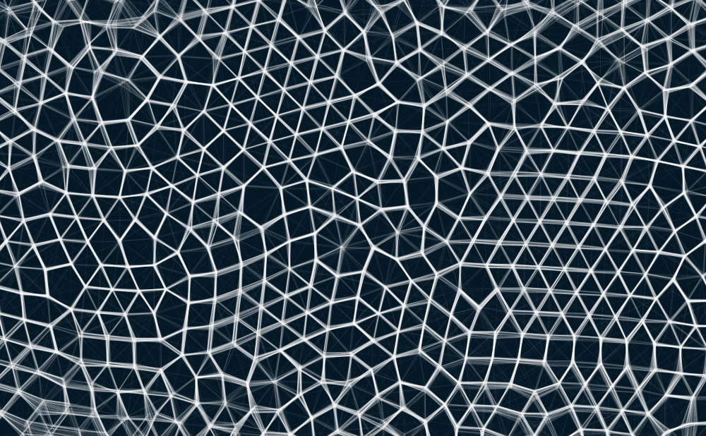
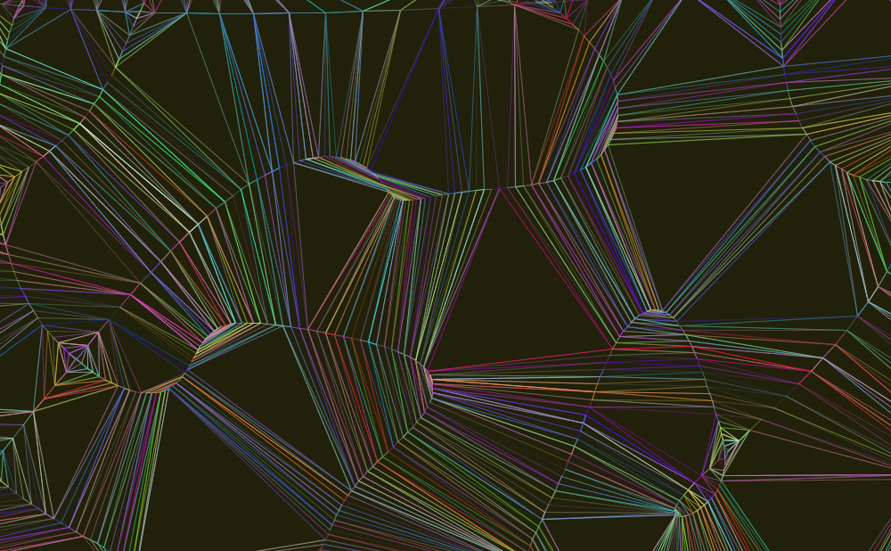
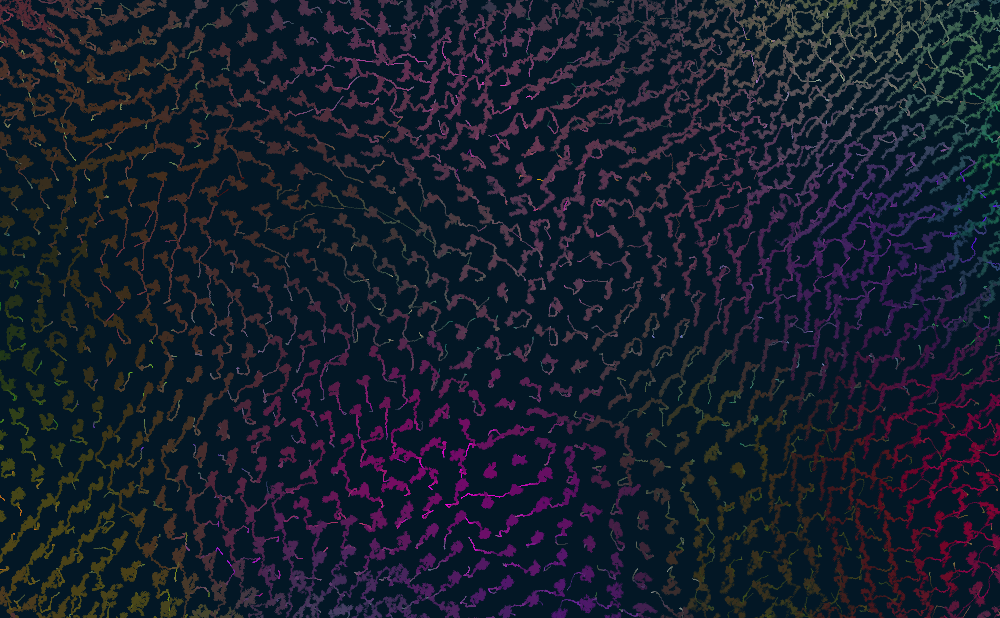
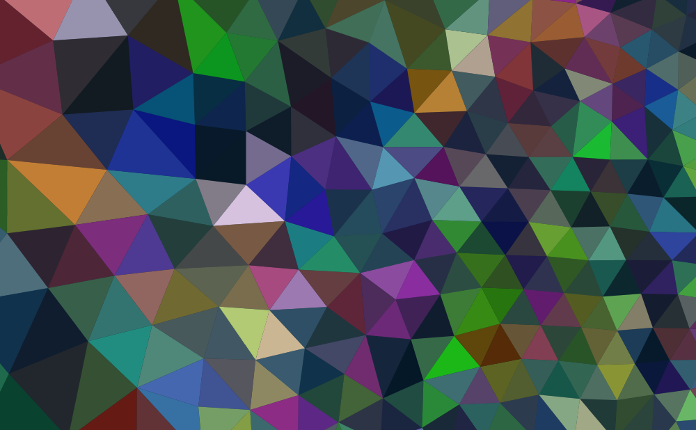
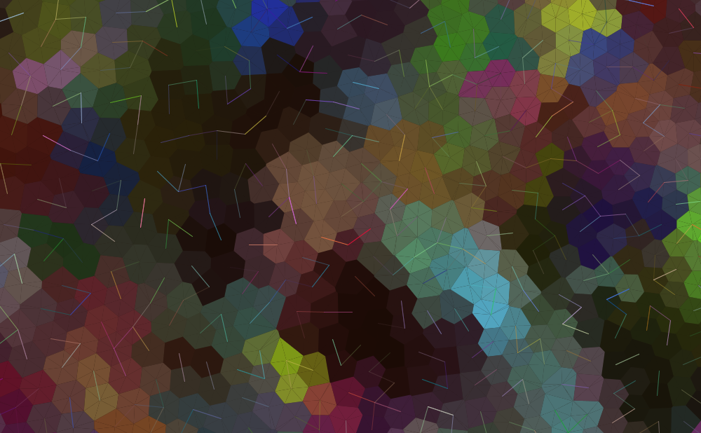

# Garbuix



## A visual tool for the exploration of generative visuals

We have a set of points randomly distributed on a 2D plane. Just by combining a set of rules on the way in which they should move, interact with each other and be displayed, we go through a rich and diverse set of visual experiences.

## Requirements

- [Processing](hhtp://processing.org)
- [NodeJS](http://nodejs.org)
- A web server like [http-server](https://github.com/nodeapps/http-server)

## Quick start

Run these commands on a terminal:
```
$ cd controls
$ npm install
$ bower install
$ node bridge.js
```
Open `processing/garbuix.pde` with Processing and run it.

On another terminal, run:
```
$ cd controls/web-side
$ http-server .
```
Now visit `http://localhost:8080/app.html` to control the running Processing sketch.
Press 's' from the Processing sketch window at any time to take a screenshot.

## Example screenshots










