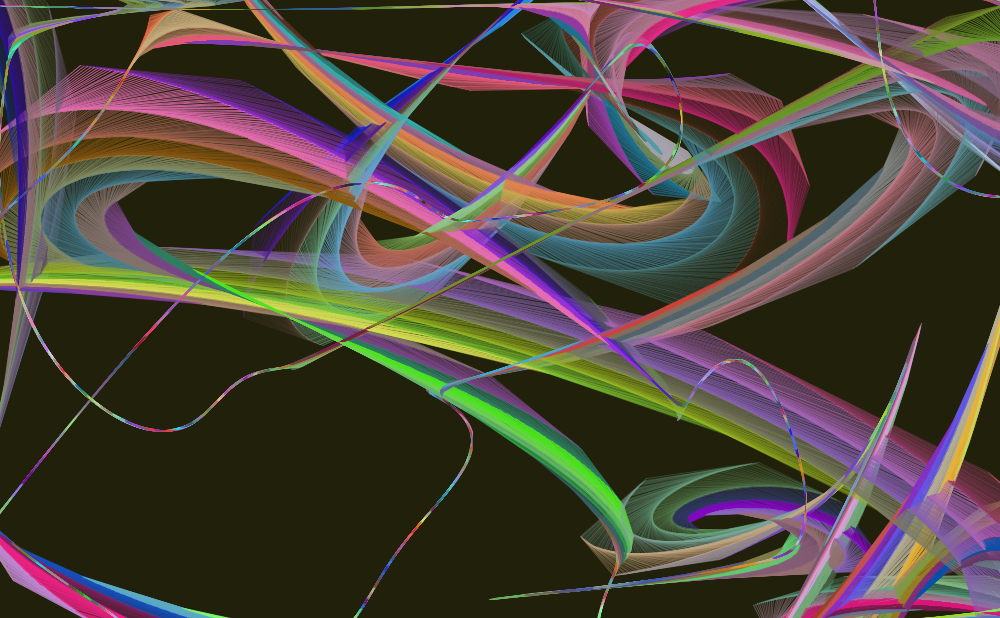

# Garbuix

## A visual tool for the exploration of generative visuals


Garbuix is the combination of a Processing sketch with a web-based user interface to explore visually interesting behaviours of 2D systems.

## Requirements

- [Processing](http://processing.org) 2 with oscP5 and gifAnimation libraries
- [NodeJS](http://nodejs.org) and [npm](https://www.npmjs.com/)
- Any web server, let's say [http-server](https://github.com/nodeapps/http-server)

## Quick start

### 1. Run the web bridge

Run these commands on a terminal:
```
$ cd controls
$ npm install
$ bower install
$ node bridge.js
```

### 2. Run the Processing sketch

Open `processing/garbuix.pde` with Processing and run it. You should get just a boring dark blank window for now.

### 3. Run the web interface

On another terminal, run:
```
$ cd controls/web-side
$ http-server .
```

### 4. Done!

Visit [http://localhost:8080](http://localhost:8080) to control the running Processing sketch.

Press `s` from the Processing sketch window at any time to take a screenshot. You can also export animated GIFs by pressing `g` to start the capture and `g` again to stop it.

## Example screenshots





